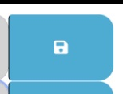

# Work Day Scheduler Starter Code
## Description

This is a simple calendar application that allows a user to save events for each hour of a typical working day (9am–5pm). This app will run in the browser and feature dynamically updated HTML and CSS powered by jQuery.

## Installation

This site was deployed using github pages. 
The following github documentation link was used to follow steps on deploying github pages: 

https://docs.github.com/en/pages/getting-started-with-github-pages/creating-a-github-pages-site

## Usage
To use the app, click on the deployed live url below. Once the page loads, you should see the scheduler for the current day and times with event field boxes to enter an event. Choose the time of where you will need to save an event you have schedule for that time. Click on the save icon:  . Your event will be saved for that time.

Link to deployed live URL [here.](https://grosario1.github.io/gil-rosario-coding-quiz-app/)

]

You can find code repo [here.](https://github.com/grosario1/gil-rosario-coding-quiz-app)

## Credits

N/A
